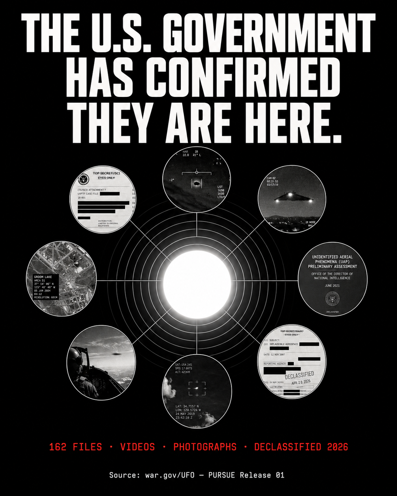

<p align="center">
  
</p>

<h1 align="center">PURSUE Release 01 — Complete Archive</h1>

<p align="center">
  <b>The first official UAP declassification by the U.S. Department of War.</b><br/>
  162 files — PDFs · Photographs · Videos — sourced verbatim from <a href="https://www.war.gov/UFO/">war.gov/UFO</a><br/>
  UAP = Unidentified Anomalous Phenomena &nbsp;·&nbsp; PURSUE = Presidential Unsealing and Reporting System for UAP Encounters
</p>

<p align="center">
  
  
  
  
  
  
</p>

---

## What is PURSUE Release 01?

**PURSUE** stands for **Presidential Unsealing and Reporting System for UAP Encounters** — the formal interagency declassification program created after President Trump issued a directive on **February 19, 2026** instructing the Department of War, FBI, NASA, and intelligence agencies to identify, review, and release UAP records.

**UAP** stands for **Unidentified Anomalous Phenomena** — redefined from "Aerial" to "Anomalous" by the James M. Inhofe National Defense Authorization Act (FY2023, signed December 23, 2022), expanding scope beyond air to include maritime, undersea, space-based, and transmedium observations.

**Release 01** went live on **May 8, 2026** at war.gov/UFO — the first large-scale official declassification of UAP materials in U.S. history. Documents span from the late 1940s to 2025. Additional tranches are expected "every few weeks."

This repository is the only publicly available complete archive with:
- Every PDF and image downloaded verbatim from war.gov
- All 28 videos — including a version with cinematic soundtracks added
- No files behind LFS paywalls, no broken clones

---

## Download Everything

> **All 3.7 GB — PDFs, photographs, videos, and videos with music — are on Google Drive, publicly accessible, no sign-in required.**

### [⬇️ Download Full Archive on Google Drive](https://drive.google.com/drive/folders/1j-cW20aJ1tGMDag6cTldIKtXMMFdpRKo?usp=sharing)

| Folder | Contents | Size |
|---|---|---|
| `pdfs/` | 126 declassified PDF documents | ~250 MB |
| `images/` | 14 photographs (FBI, NASA, DoD) | ~15 MB |
| `videos/` | 28 original videos from DVIDS | ~3.4 GB |
| `videos-with-music/` | 27 videos with cinematic instrumental soundtrack added | ~1.1 GB |

---

## What's In The Files

The release covers incidents spanning multiple decades and commands:

- **DOW-UAP-D series** — Mission Reports documenting UAP encounters
- **DOW-UAP-PR series** — Unresolved UAP Incident Reports (Middle East, Iraq, Syria, INDOPACOM, Africa)
- **FBI files** — Historical UAP investigation documents and photographs
- **NASA files** — Apollo 12 & 17 photographs, Gemini 7 audio excerpt (1965)
- **DIA / NSA / NRO** — Intelligence agency UAP assessments
- **Video footage** — Raw military UAP encounter video from DVIDS

Two files (`Serial_153` and one other) return 404 on war.gov itself — they are not missing from this archive, they simply do not exist at the source.

---

## Download It Yourself

If you prefer to pull directly from war.gov:

```bash
pip install curl_cffi
python download_uap.py
```

This uses Chrome TLS impersonation to bypass Akamai CDN bot protection — the same technique needed to access war.gov files programmatically.

### Add Cinematic Music to Videos

```bash
python add_music.py
```

Pulls dark/thriller instrumental tracks from Pixabay (royalty-free, no lyrics) and mixes one unique track per video using ffmpeg.

**Requirements:** `pip install curl_cffi` · `ffmpeg` · `yt-dlp`

---

## Source

All files sourced from the official U.S. Department of War UAP portal:
**[https://www.war.gov/UFO/](https://www.war.gov/UFO/)**

This archive is for research, journalism, and public record purposes.
